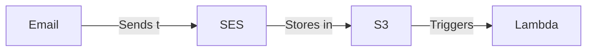

# Email-initiated workflow template

This repo contains starter code for creating an email-initiated automation using AWS [SES](https://aws.amazon.com/ses/) and Lambda.

## 🧐 How it works

An email-initiated workflow is a way to automate a process using email as the trigger. Send an email to a specific address, and the workflow (a Lambda function in this case) will take action using the email's contents as the input.



1. An email is sent to a specific address associated with a domain that you own.
1. SES receives the email and stores it in an S3 bucket.
1. S3 triggers a Lambda function.
1. The Lambda function reads the email from S3 and runs your code against it.

## 🖼️ Examples

It's up to you to decide what the workflow does. Some example use cases:

- [Parse expense emails using GPT-3, and add the data to rows in a spreadsheet](https://github.com/sawyerh/expense-email-gpt)
- [Export Kindle reading highlights to a personal website](https://github.com/sawyerh/highlights)

If you come up with something cool, [I'd love to hear about it](https://github.com/sawyerh/aws-email-workflow-starter/discussions/new?category=show-and-tell).

## 📂 Project structure

The codebase is written in [TypeScript](https://www.typescriptlang.org/) and uses [AWS CDK](https://aws.amazon.com/cdk/) to manage the AWS resources and deployments.

```
├── .github             # GitHub Actions workflows
├── bin
│   └── aws-app.ts      # AWS CDK entry point
├── lib
│   ├── reader.ts       # Lambda function for reading emails
│   ├── stacks          # AWS CDK stacks
│   └── constructs      # Groupings of AWS resources
└── tests
```

## 🧰 Setup instructions

**[To setup your initial AWS environment, follow these instructions.](./docs/create-environment.md)**

## 🚀 Deploying updates

After you've ran through the setup instructions, you can deploy updates to the Lambda function or AWS resources by running:

```sh
npm run deploy
```

## 💅 Tips

- Pass environment variables to your Lambda function by updating the `environment` property in the `NodejsFunction` construct (search in `LambdaS3Reader.ts`).
- [AWS CDK library docs are here](https://docs.aws.amazon.com/cdk/api/v2/)
- By default, SES is in "Sandbox" mode. This means that you can only send emails to verified email addresses. This might be fine for personal projects. [You can take this action to move out of sandbox mode.](https://docs.aws.amazon.com/ses/latest/dg/request-production-access.html).
- Resource not showing up in AWS? Make sure the region you're viewing in the console matches the region you're deploying to.
- If initial deploy fails and gets stuck in a failed state, you can delete the stack and try again. To preserve the SES domain identity, and destroy all other AWS resources (S3 bucket, SES rules, and Lambda function):

  Run the following, where `{STACK_PREFIX}` is the environment value from your `.env`

  ```sh
  npx cdk destroy --exclusively {STACK_PREFIX}-Reader
  ```

  You can run `npx cdk ls` to view the stack names that you can pass to the `--exclusively` flag. Or you can delete all stacks using the `--all` flag.
